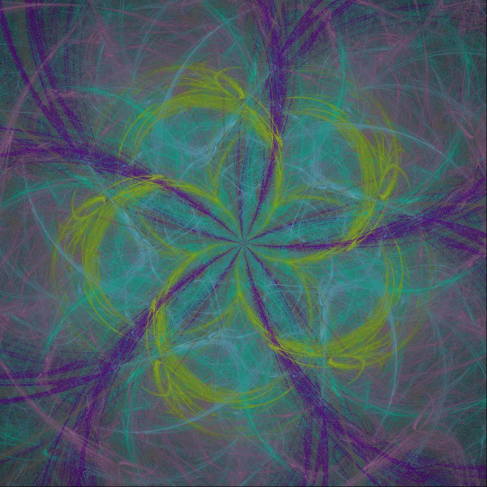

## Академия Бэкенда 1 семестр

Кратко рассмотрим все проекты в рамках 1-го семесетра курса "Академия Бэкенда"

### Модуль 5. Разработка в команде

> Обзор методологий разработки, инструментария и практик совместной работы в различных сценариях и окружениях

Проект в рамках модуля:

[](https://github.com/srBob01/term1-efficiency)

Особенности проекта:
- Cравнения различных способов вызова методов в Java с помощью JMH (Java Microbenchmarking Harness).
- Java 22 ☕️ 
- Lombok 🌶️
- Maven

Результат:

| Метод                   | Среднее время выполнения (ns/op) | Погрешность (ns/op) | Описание                                                                                                                     |
|-------------------------|----------------------------------|---------------------|------------------------------------------------------------------------------------------------------------------------------|
| **`directAccess`**      | **0,836**                        | ± 0,019             | Прямой вызов метода `name()`. Самый быстрый подход, так как нет накладных расходов.                                          |
| **`lambdaMetafactory`** | **1,174**                        | ± 0,028             | Вызов через `LambdaMetafactory`. Очень близок к прямому вызову, но немного медленнее.                                        |
| **`methodHandles`**     | **6,600**                        | ± 0,134             | Использование `MethodHandles`. Затраты на динамическое разрешение метода выше.                                               |
| **`reflection`**        | **10,701**                       | ± 0,248             | Использование рефлексии. Самый медленный способ из-за накладных расходов на проверку безопасности и динамическое разрешение. |

---

### Модуль 4. Многопоточность и асинхронность

> Разбор принципов и техник разработки асинхронного и многопоточного ПО, включая синхронизацию данных и параллелизм

Проект в рамках модуля:

[](https://github.com/srBob01/term1-fractalFlame)

Особенности проекта:
- Однопоточный и многопоточный рендеринг изображений
- Рендеринг изображений с осью симметрии
- Типы преобразования изображений: (дисковое, сердцевинное, линейное, полярное, синусоидальное, сферическое)
- Нормализация изображения
- Java 22 ☕️ 
- JCommander 
- Lombok 🌶️
- JUnit 5
- Maven

Пример работы:

Изначальные параметры: symmetry=4, transformationsCount=5

| samples | iterations | threadCount | time_ms |
|---------|------------|-------------|---------|
| 1000    | 500        | 1           | 1523    |
| 1000    | 500        | 2           | 692     |
| 1000    | 500        | 4           | 378     |
| 1000    | 500        | 8           | 286     |
| 1000    | 500        | 16          | 326     |



---

### Модуль 3. Качество и тестирование ПО

> Погружение в методологии и практики обеспечения качества ПО, включая юнит-тестирование, интеграционное тестирование и системы непрерывной интеграции

Проект в рамках модуля:

[](https://github.com/srBob01/term1-logAnalyzer)

Особенности проекта:
- Парсинг NGINX логов
- вывод: 95 перцентиль размера ответа, запрашиваемых ресурсов, читаемые коды ответа и др.
- StreamAPI - для потоковой обработки логов
- Java 22 ☕️ 
- JCommander 
- Lombok 🌶️
- JUnit 5
- Maven

---

### Модуль 2. Принципы и шаблоны проектирования

> Обзор основных принципов проектирования программного обеспечения и популярных шаблонов разработки

Проект в рамках модуля:

[](https://github.com/srBob01/term1-labirnts)

Особенности проекта:
- Алгоритмы генерации лабиринтов - алгоритм Прима и Краскала.
- Алгоритмы поиска пути - поиск в ширину (BFS) и А* (A-star).
- Java 22 ☕️ 
- Lombok 🌶️
- JUnit 5
- Maven

Пример работы:

 ```plaintext
    +---+---+---+
    |   =     B |
    + ~ + = + ~ +
    |   ~ B ~ G |
    + ~ + = +   +
    | B |   ~ G |
    +---+---+---+
   ```

---

### Модуль 1. Парадигмы программирования

> Изучение различных стилей и парадигм программирования, включая процедурное, объектно-ориентированное и функциональное программирование

Проект в рамках модуля:

[](https://github.com/srBob01/term1-gallows)

Особенности проекта:
- Реализация через паттерн [состояние](https://refactoring.guru/ru/design-patterns/state)
- Java 22 ☕️ 
- Lombok 🌶️
- JUnit 5
- Maven
